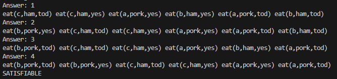
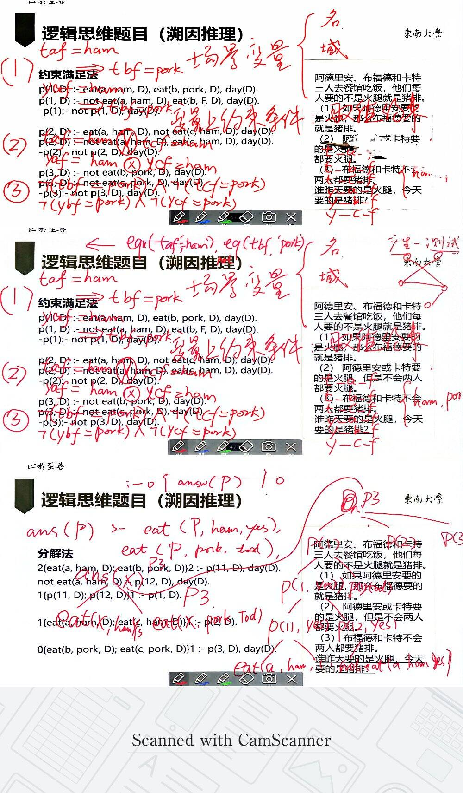
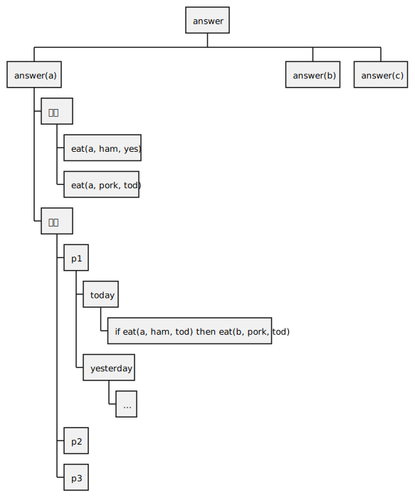

# 分解法
## 思路
<!-- answer分解为每个选项的条件，选项条件成立时，判断是否满足题目的规则限制 -->

<!-- answer(B) -> conclusion & rule

rule -> answer sets * 4



---

a ham yes & pork tod -> whether rules satisfied 

if answer a then aa

aa: if conclusion then rule  -->

以问题作为根源，将其分解为求解目标和规则两部分。

求解目标分解为每个选项的成立条件。

规则分解为能够满足规则的各种情况。

最后，确认哪个求解目标（选项）与规则成立情况不冲突。


```
knowledge.

answer.

2{options, rule}2 :- answer.

0{option(a); option(b); option(c)}3 :- options.

0{situation1, situation2}1 :- rule.

#show option/1.
```

<!-- ---

what if definition method?

hypothesis is true $iff$ it's in all the possible answer sets based on the rule

`true(h) :- in(h, rule), not ntrue(h)`

`ntrue(h) :- ???`

``

---

answer $\rightarrow$  possible answers $\rightarrow$ hypothesis & rule


 -->

<!-- ## 案例
### 火腿/猪排
阿德里安、布福德和卡特三人去餐馆吃饭，他们每人要的不是火腿就是猪排。

（1）	如果阿德里安要的是火腿，那么布福德 要的就是猪排。

（2）	阿德里安或卡特要的是火腿，但是不会两人都要火腿。

（3）	布福德和卡特不会两人都要猪排。

谁昨天要的是火腿，今天要的是猪排？

```
person(a).
person(b).
person(c).
food(ham).
food(pork).
day(yes).
day(tod).
1{eat(P, F, D):food(F)}1 :- person(P), day(D).

answer.

1{answer(P) : person(P)}3 :- answer.

3{eat(P, ham, yes); eat(P, pork, tod); p}3 :- person(P), answer(P).

6{p(1, yes); p(2, yes);p(3, yes); p(1, tod);p(2, tod);p(3, tod)}6 :- p.

2{eat(a,ham,D);eat(b,pork,D)}2:-p(11,D),day(D).
not eat(a,ham,D):-p(12,D),day(D).
1{p(11,D);p(12,D)}1:-p(1,D).
1{eat(a,ham,D);eat(c,ham,D)}1:-p(2,D).
0{eat(b,pork,D);eat(c,pork,D)}1:-p(3,D),day(D).

#show answer/1.
``` -->


### 规则成立情况的推理
```
古代一位国王和他的张、王、李、赵、钱五位将军，一同出外打猎，各人的箭上都刻有自己的姓氏。打猎中，一只鹿中箭倒下，但不知是何人所射。

张说：“或者是我射中的，或者是李将军射中的。”

王说：“不是钱将军射中的。”

李说：“如果不是赵将军射中的，那么一定是王将军射中的。”

赵说：“既不是我射中的，也不是王将军射中的。”

钱说：“既不是李将军射中的，也不是张将军射中的。”

国王让人把射中鹿的箭拿来，看了看，说：“你们五位将军的猜测，只有两个人的话是真的。”

请根据国王的话，判定以下哪项是真的？

（A） 张将军射中此鹿。
（B） 王将军射中此鹿。
（C） 李将军射中此鹿。
（D） 赵将军射中此鹿。
（E） 钱将军射中此鹿。

```
 

- 若p1正确，鹿是张将军或李将军射中的。
  - p5错误，其与p1相互否定。
  - p3错误，其与p1相互否定。
  - p4正确，其符合p1。
  - p2正确，其符合p1。
  - 根据知识“只有两个命题为真。”，此次推论不成立，即p1正确不成立。
- 若p1错误，鹿不是张将军或李将军射中的。
  - p5正确，其与p1相互否定。
  - 若p3正确，如果不是赵将军射中的，那么一定是王将军射中的。
    - p4错误，其与p3相互否定。
    - p2正确，其符合p3。
    - 根据知识“只有两个命题为真。”，此次推论不成立，即p3正确不成立。
  - 若p3不正确，既不是赵将军射中的，也不是王将军射中的。
    - p4正确，其与p3相互否定。
    - 若p2正确，鹿不是钱将军射中的。
      - 根据知识“只有两个命题为真。”，此次推论不成立，即p2正确不成立。
    - 若p2错误，鹿是钱将军射中的。
      - 符合条件，因此结果为鹿是钱将军射中的。此时，p4、p5正确，p1、p2、p3错误。

---

```
甲、乙、丙、丁4人，一人是教师，一人是医生，一人是作家，一人是律师。现已知:
①甲的年龄比教师大； 
②乙和律师的籍贯不同；
③丙与作家的籍贯相同；
④作家的年龄比乙小；
⑤甲与律师来自相同的城市；
⑥教师的籍贯与乙相同。
x1,x2,x3,x4 -年龄
y1,y2,y3,y4 -籍贯
根据以上的信息，以下说法不正确的是:
A.作家的年龄比教师大
B.医生与律师的籍贯相同
C.医生的年龄比作家大
D.律师与教师的籍贯不同
```
 


---

```
阿德里安、布福德和卡特三人去餐馆吃饭，他们每人要的不是火腿就是猪排。

（1） 如果阿德里安要的是火腿，那么布福德要的就是猪排。

（2） 阿德里安或卡特要的是火腿，但是不会两人都要火腿。

（3） 布福德和卡特不会两人都要猪排。

谁昨天要的是火腿，今天要的是猪排？
```

 

---

```
某医院刘佳、郑毅、郭斌、丁晓、吴芳、施文6位医生拟报名参加“一心向党，健康为民”进社区义诊活动，已知下列情况为真：
（1）要么刘佳参加，要么郑毅参加；
（2）只有吴芳参加，刘佳才参加；x1 * (1-x2)=0
（3）如果郭斌和吴芳都参加，那么施文也会参加；x3 = x1*x2
（4）或者丁晓不参加，或者郭斌参加；
（5）施文、丁晓至少有1人参加。
 
现施文确定无法参加，那么6位医生中最后参加义诊活动的是：
A.刘佳、郭斌、丁晓
B.郑毅、郭斌、丁晓
C.郑毅、丁晓、吴芳
D.刘佳、丁晓、吴芳

```

 

---

```
甲、乙、丙、丁4人参加预选赛。对于预选赛结果,几位教练预测如下:
(1)如果甲、乙均未通过，则丙通过
(2)如果乙、丙至少有1人通过，则丁也通过
(3)如果甲、乙至少有1人通过，则丙也通过，但是丁不通过。
根据几位教练的预测，可以推出:
A．丙和丁通过
B．甲和丁通过
C.甲和乙通过
D．乙和丙通过
```

 


<!--   -->


<!--  

  -->

