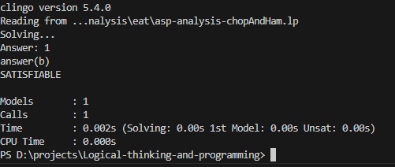
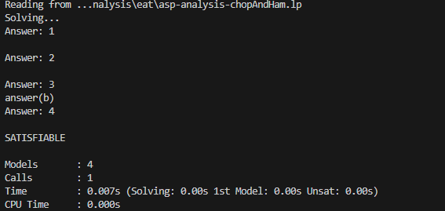

- [题目](#题目)
- [逻辑模式](#逻辑模式)
- [题目来源](#题目来源)
- [分析](#分析)
  - [命题](#命题)
  - [知识](#知识)
  - [任务目标](#任务目标)
  - [思维过程](#思维过程)
  - [结论](#结论)
- [ASP 表示](#asp-表示)
- [AF 表示](#af-表示)
- [总结](#总结)

---

<!-- ## 要求
介绍一个经典案例，条理地用自然语言描述案例中的命题、知识、任务目标和思维过程，尽可能的使用ASP、AF写出来。 -->

<!-- ## 题目0


## 解答
根据（1）和（2），如果阿德里安要的是火腿，那么布福德要的就是猪排，卡特要的也是猪排。这种情况与（3）矛盾。因此，阿德里安要的只能是猪排。

于是，根据（2），卡特要的只能是火腿。

因此，只有布福德才能昨天要火腿，今天要猪排。
 -->


## 题目
阿德里安、布福德和卡特三人去餐馆吃饭，他们每人要的不是火腿就是猪排。

（1）	如果阿德里安要的是火腿，那么布福德要的就是猪排。

（2）	阿德里安或卡特要的是火腿，但是不会两人都要火腿。

（3）	布福德和卡特不会两人都要猪排。

谁昨天要的是火腿，今天要的是猪排？

<!-- ## 解答
根据（1）和（2），如果阿德里安要的是火腿，那么布福德要的就是猪排，卡特要的也是猪排。这种情况与（3）矛盾。因此，阿德里安要的只能是猪排。

于是，根据（2），卡特要的只能是火腿。

因此，只有布福德才能昨天要火腿，今天要猪排。 -->

## 逻辑模式
溯因推理

## 题目来源
MBA考试辅导逻辑分册

## 分析
### 命题
- p1: 如果阿德里安要的是火腿，那么布福德要的就是猪排。
- p2: 阿德里安或卡特要的是火腿，但是不会两人都要火腿。
- p3: 布福德和卡特不会两人都要猪排。

### 知识
- 人：阿德里安、卡特、布福德
- 日期：昨天、今天
- 食物：火腿、猪排
- 每人每顿吃且只吃一种食物（隐含）


### 任务目标
谁昨天要的是火腿，今天要的是猪排？

### 思维过程


### 结论
布福德昨天要火腿，今天要猪排。

## ASP 表示
```
person(a).
person(b).
person(c).
food(ham).
food(pork).
day(yes).
day(tod).

1{eat(P, F, D):food(F)}1 :- person(P), day(D).
```
> 命题描述1
```
-p(1) :- eat(a, ham, D), not eat(b, pork, D), day(D).
-p(2) :- not eat(a, ham, D), not eat(c, ham, D), day(D).
-p(2) :- eat(a, ham, D), eat(c, ham, D), day(D).
-p(3) :- eat(b, pork, D), eat(c, pork, D), day(D).
```
> 命题描述2
```
p(1, D) :- eat(a, ham, D), eat(b, pork, D), day(D).
p(1, D) :- not eat(a, ham, D), eat(b, F, D), day(D).
-p(1):- not p(1, D), day(D).

p(2, D) :- eat(a, ham, D), not eat(c, ham, D), day(D).
p(2, D) :- not eat(a, ham, D), eat(c, ham, D), day(D).
-p(2):- not p(2, D), day(D).

p(3, D) :- not eat(b, pork, D), day(D).
p(3, D) :- not eat(c, pork, D), day(D).
-p(3):- not p(3, D), day(D).
```

```
3{p(1;2;3)}3.
answer(P) :- person(P), eat(P, ham, yes), eat(P, pork, tod).
:- 0{answer(P):person(P)}0.

% #show eat/3.
% #show p/1.
#show answer/1.
```

运行结果:



> 若将 `:- 0{answer(P):person(P)}0.` 改为 `1{answer(P)} :- person(P), eat(P, ham, yes), eat(P, pork, tod).`:


## AF 表示


## 总结
- 不能用统一谓词来表示逻辑类型的命题，这样只适用于耦合度为0的命题，而命题之间可能存在依赖关系(存在多个参数时，依赖关系可能很复杂)。它应该放在NL到ASP的转化程序中。

<style>
    .custom-code {
        color: red;
        background-color: lightgray;
        padding: 10px;
    }
</style>


