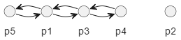

## 要求
介绍一个经典案例，条理地用自然语言描述案例中的命题、知识、任务目标和思维过程，尽可能的使用ASP、AF写出来。

<!-- ## 题目0
阿德里安、布福德和卡特三人去餐馆吃饭，他们每人要的不是火腿就是猪排。

（1）	如果阿德里安要的是火腿，那么布福德要的就是猪排。

（2）	阿德里安或卡特要的是火腿，但是不会两人都要火腿。

（3）	布福德和卡特不会两人都要猪排。

谁昨天要的是火腿，今天要的是猪排？

## 解答
根据（1）和（2），如果阿德里安要的是火腿，那么布福德要的就是猪排，卡特要的也是猪排。这种情况与（3）矛盾。因此，阿德里安要的只能是猪排。

于是，根据（2），卡特要的只能是火腿。

因此，只有布福德才能昨天要火腿，今天要猪排。
 -->


## 题目
古代一位国王和他的张、王、李、赵、钱五位将军，一同出外打猎，各人的箭上都刻有自己的姓氏。打猎中，一只鹿中箭倒下，但不知是何人所射。

张说：“或者是我射中的，或者是李将军射中的。”

王说：“不是钱将军射中的。”

李说：“如果不是赵将军射中的，那么一定是王将军射中的。”

赵说：“既不是我射中的，也不是王将军射中的。”

钱说：“既不是李将军射中的，也不是张将军射中的。”

国王让人把射中鹿的箭拿来，看了看，说：“你们五位将军的猜测，只有两个人的话是真的。”

请根据国王的话，判定以下哪项是真的？

（A）	张将军射中此鹿。
（B）	王将军射中此鹿。
（C）	李将军射中此鹿。
（D）	赵将军射中此鹿。
（E）	钱将军射中此鹿。

<!-- ## 解答
在五位将军的话语中，张将军的话和钱将军的话是矛盾的，张将军的话具有“p 或者 q”的形式，其中 p 表示“张将军射中此鹿”，q 表示“李将军射中此鹿”；钱将军的话恰好具有“非 p 并且非 q”的形式，根据复合命题的负命题的知识，可以确定张将军和钱将军的话是相互否定的，亦即两个人的话中必有一真，必有一假。另外，李将军的话和赵将军的话也是矛盾的，李将军的话具有“如果非 P，那么 q”的形式，其中，p 表示“赵将军射中此鹿”，q 表示“王将军射中此鹿”；赵将军的话恰好具有“非 p 并且非 q”的形式，根据复合命题的负命题的知识，可以确定李将军和赵将军的话是相互否定的，亦即两个人的话中必有一真，必有一假。这样，不论张将军和钱将军。李将军和赵将军的话中，何者为真，何者为假，但可以肯定其中必有两个人的话是真的，那么，根据题意，剩下王将军所说的话就一定是假话。王将军说的是“不是钱将军射中此鹿”，既然此话为假，那就可以断定是钱将军射中此鹿的。确定了是钱将军射中此鹿的，就可以知道张将军的话是假的， 
**钱将军的话是真的**；李将军的话是假的，**赵将军的话是真的**。

解答此类试题，具有了复合命题及负复合命题的等值命题的有关知识，确定了哪两对复合命题具有矛盾关系，就比较容易了。 -->


## 自然语言描述
### 命题
- p1: 鹿是张将军或李将军射中的。
- p2: 鹿不是钱将军射中的。
- p3: 如果不是赵将军射中的，那么一定是王将军射中的。
- p4: 既不是赵将军射中的，也不是王将军射中的。
- p5: 既不是李将军射中的，也不是张将军射中的。


### 知识
- 将军：张将军、王将军、李将军、赵将军、钱将军。
- 有一个人射中了鹿。
- 只有两个命题为真。

### 任务目标
目标：哪位将军射中了鹿？

### 思维过程
- 若p1正确，鹿是张将军或李将军射中的。
  - p5错误，其与p1相互否定。
  - p3错误，其与p1相互否定。
  - p4正确，其符合p1。
  - p2正确，其符合p1。
  - 根据知识“只有两个命题为真。”，此次推论不成立，即p1正确不成立。
- 若p1错误，鹿不是张将军或李将军射中的。
  - p5正确，其与p1相互否定。
  - 若p3正确，如果不是赵将军射中的，那么一定是王将军射中的。
    - p4错误，其与p3相互否定。
    - p2正确，其符合p3。
    - 根据知识“只有两个命题为真。”，此次推论不成立，即p3正确不成立。
  - 若p3不正确，既不是赵将军射中的，也不是王将军射中的。
    - p4正确，其与p3相互否定。
    - 若p2正确，鹿不是钱将军射中的。
      - 根据知识“只有两个命题为真。”，此次推论不成立，即p2正确不成立。
    - 若p2错误，鹿是钱将军射中的。
      - 符合条件，因此结果为鹿是钱将军射中的。此时，p4、p5正确，p1、p2、p3错误。

## ASP 表示
```
person(z).
person(w).
person(l).
person(zhao).
person(q).

p(z) :- shoot(z), not shoot(l).
p(z) :- not shoot(z), shoot(l).
p(w) :- not shoot(q).
p(l) :- shoot(zhao).
p(l) :- not shoot(zhao), shoot(w).
p(zhao) :- not shoot(zhao), not shoot(w).
p(q) :- not shoot(l), not shoot(z).

1{shoot(X) : person(X)}1.
2{p(X) : person(X)}2.

#show p/1.
#show shoot/1.
```

## AF 表示
